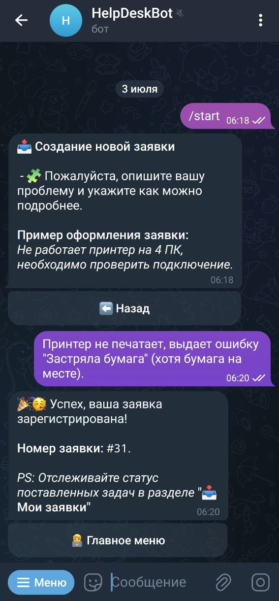
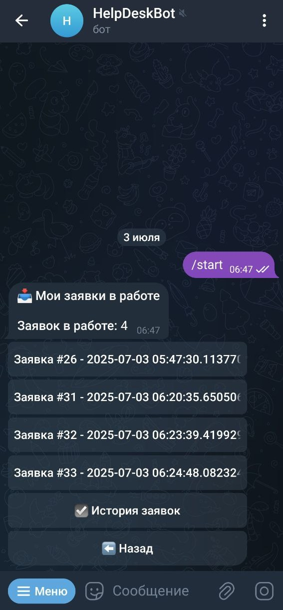
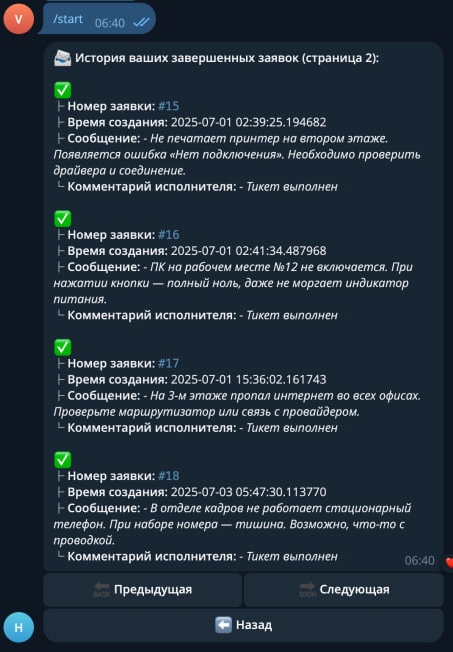
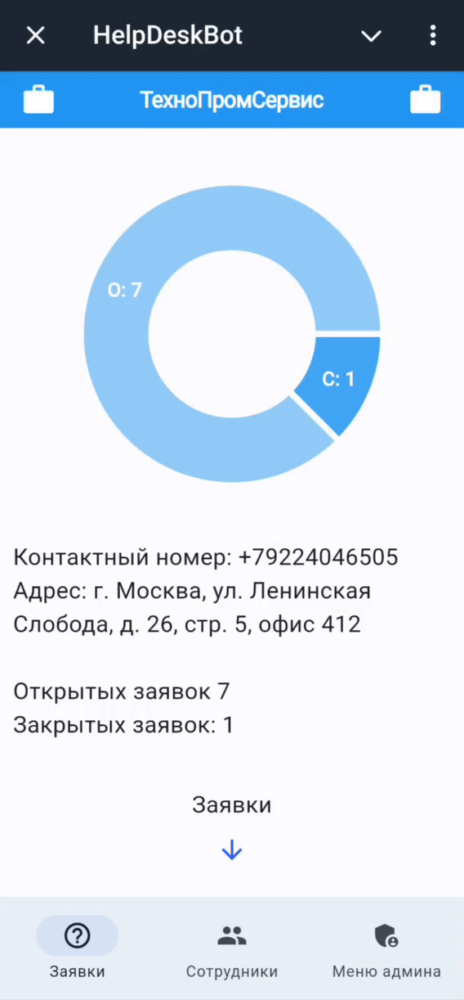
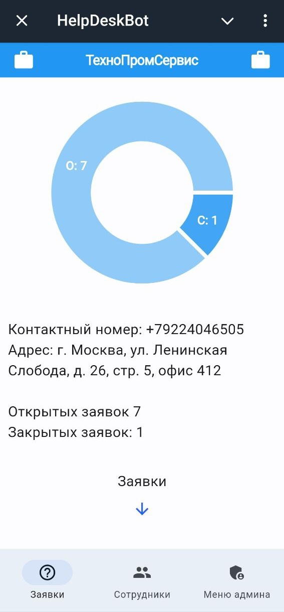
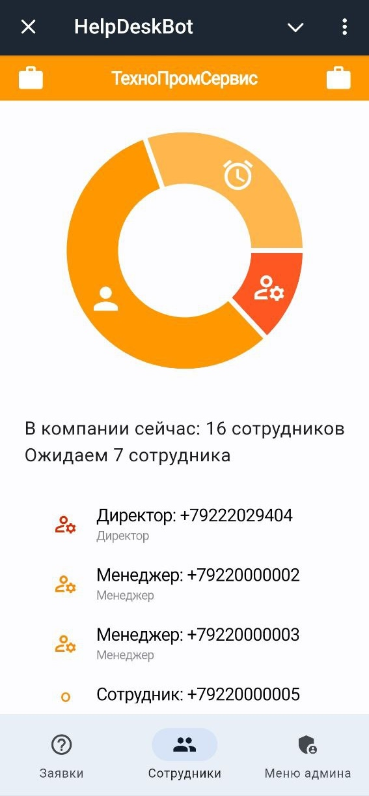
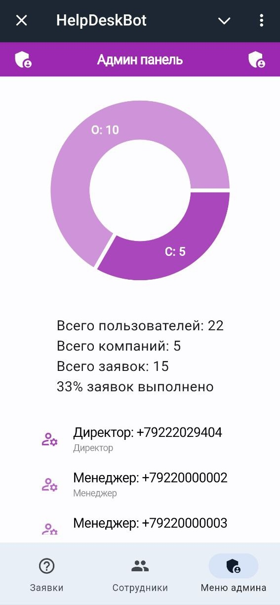

# HelpDesk Telegram Bot


## 📚 Оглавление

## 📚 Оглавление

- [Введение](#введение)
- [Описание](#описание)
- [Возможности](#возможности)
- [Структура проекта](#структура-проекта)
- [Примеры основного функционала работы](#примеры-основного-функционала-работы)
  - [Авторизация пользователя](#авторизация-пользователя)
  - [Создание компании](#создание-компании)
  - [Создание тикета](#создание-тикета)
  - [Добавление нового сотрудника](#добавление-нового-сотрудника)
  - [Пагинация](#пагинация)
  - [Текущие активные личные тикеты](#текущие-активные-личные-тикеты)
  - [История личных выполненных тикетов](#история-личных-выполненных-тикетов)
  - [UI](#ui)
- [Установка и запуск](#установка-и-запуск)
  - [Необходимые пакеты](#необходимые-пакеты)
  - [Запуск на ngrok](#запуск-на-ngrok)
  - [Запуск на LocalTunnel](#запуск-на-localtunnel)
  - [Запуск UI для доработок](#запуск-ui-для-доработок)
- [Примечание](#примечание)


## Введение
HelpDesk Telegram Bot — это простой и удобный в использовании Telegram-бот, который помогает компаниям эффективно управлять заявками и задачами сотрудников.

## Описание
Этот проект представляет собой многофункционального Telegram-бота для HelpDesk системы, предназначенного для оптимизации взаимодействия внутри компании и упрощения поддержки пользователей. Система автоматизирует сбор заявок, управление ими и мониторинг статусов, обеспечивая прозрачность и контроль на всех уровнях.

Основные возможности включают интерактивное анкетирование для удобного создания заявок, надёжное хранение информации в базе данных, мгновенные уведомления для ответственных сотрудников, а также гибкую систему ролей и прав доступа. 

Административная панель позволяет управлять компаниями, сотрудниками и заявками в реальном времени, а аналитические инструменты помогают отслеживать эффективность работы команды и принимать обоснованные решения.

Авторизация по номеру телефона через Telegram упрощает вход в систему без необходимости запоминать пароли, делая процесс максимально удобным и безопасным.

В результате проект обеспечивает прозрачный, быстрый и организованный процесс обработки заявок, улучшая качество обслуживания и внутреннюю коммуникацию в компании.

## Возможности

> - 🎫 **Создание тикетов пользователями**  
>   Пользователи могут создавать заявки через Telegram-бота в один клик.  
>  
> - 🏢 **Создание и управление компаниями**  
>   Компании создаются администраторами, а управление ими осуществляется директорами, менеджерами.  
>  
> - 📱 **Авторизация по номеру телефона**  
>   Удобная авторизация одним нажатием с подтверждением через Telegram.  
>  
> - 👥 **Система ролей:**  
>   - **Директор** — полный контроль над компанией, назначает менеджеров и сотрудников  
>   - **Менеджер** — управляет заявками и персоналом  
>   - **Сотрудник** — создаёт заявки, отслеживает свои  
>   - **Администратор бота** — управляет глобальными настройками и компаниями  
>  
> - 📊 **Просмотр статистики компании**  
>   Количество заявок, распределение по статусам через интуитивный веб-интерфейс с диаграммами.  
>  
> - 📂 **Просмотр заявок конкретного сотрудника**  
>   Директор и менеджер могут отслеживать активность персонала в удобном списке с фильтрацией.  
>  
> - ➕ **Добавление сотрудников по номеру телефона**  
>   Приглашение новых сотрудников в компанию с мгновенной привязкой.  
>  
> - 🔁 **Назначение и смена ролей**  
>   Директор может менять роль сотрудника на менеджера и наоборот.  
>  
> - 📜 **История заявок пользователя**  
>   У каждого пользователя есть доступ к своим предыдущим обращениям через веб-интерфейс.  
>  
> - 🖥️ **Веб-интерфейс управления**  
>   Интуитивный адаптивный UI с разделением по ролям:  
>   - **Заявки**: диаграммы статусов, списки с детализацией  
>   - **Сотрудники**: визуализация структуры компании  
>   - **Админ-панель**: глобальная статистика системы

## Структура проекта

```plaintext
project-root/
├── config.py # Файл конфигурации
├── UI.py # Основной UI-интерфейс (Flet)
├── main.py # Точка входа
├── flet_app.py # Отдельная Flet-приложуха (если используется)
├── example.db # Пример базы данных
├── LICENSE
├── SECURITY.md
├── README.md
├── requirements.txt
├── assets/ # Гифки и изображения для README
├── app/
│ ├── init.py
│ ├── UI/
│ │ └── views/ # Представления интерфейса (Flet Views)
│ │ ├── tickets_view.py
│ │ ├── workers_view.py
│ │ └── admin_view.py
│ ├── filters/ # Кастомные фильтры
│ │ └── user_filters.py
│ ├── handlers/ # Хендлеры для обработки логики
│ │ ├── init.py
│ │ ├── admin_handlers.py
│ │ ├── company_handlers.py
│ │ ├── direction_handlers.py
│ │ ├── ticket_handlers.py
│ │ └── user_handlers.py
│ ├── keyboards/ # Inline/Reply клавиатуры
│ │ ├── admin_keyboards.py
│ │ ├── common_keyboards.py
│ │ ├── company_keyboards.py
│ │ ├── direction_keyboards.py
│ │ ├── ticket_keyboards.py
│ │ └── user_keyboards.py
│ ├── models/ # ORM-модели (DB-сущности)
│ │ ├── company.py
│ │ ├── expectedworker.py
│ │ ├── ticket.py
│ │ └── user.py
│ ├── repositories/ # Работа с базой данных
│ │ ├── init.py
│ │ ├── base_repository.py
│ │ ├── company_repository.py
│ │ ├── expected_worker_repository.py
│ │ ├── ticket_repository.py
│ │ └── user_repository.py
│ ├── services/ # Бизнес-логика
│ │ ├── company_service.py
│ │ ├── expected_worker_service.py
│ │ ├── ticket_service.py
│ │ └── user_service.py
│ ├── states/ # Состояния FSM
│ │ └── company_states.py
│ └── database.db # Основная SQLite-база

```


## Примеры основного функцилонала работы
### Авторизация пользователя:


### Создание компании:


### Создание тикета:


### Добавление нового сотрудника


### Пагинация:


### Текущие активные личные тикеты:


### История личных выполненых тикетов:


### UI 






Необходимые пакеты:
- ```  pip install aiogram==3.7.0 ```
- ```  pip install flet==0.22.1```

Запуск на ngok:
- Необходимо установить **ngok**
- Запафить **ngrok** в винде
- Открыть командную строку, прописать ```ngrok http 80```
- Взять URL https и добавить в переменную **UI_URL**(config.py)
- ``` python UI.py``` 
- ```  python main.py ``` 

запуска на LocalTunnel:
-npm install -g localtunnel
-lt --port 80
- Взять URL https и добавить в переменную **UI_URL**(config.py)
- ``` python UI.py``` 
- ```  python main.py ``` 

Запуск UI для доработок:

``` flet run UI.py ```


## Примечание
Этот README.md может быть дополнен дальнейшей информацией о конфигурации, установке, использовании и других функциях бота по мере развития проекта.


